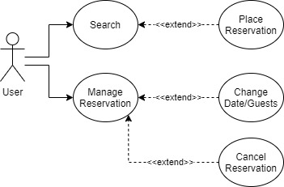
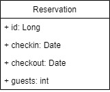

# Famous Hotel Booking API

***
### Summary
This API has the purpose to help book the only and disputed room of the Famous Hotel.

#### The REST user is able to:
* 

#### The web pages user is able to:
* See the available dates on the calendar
* Place a reservation on a preferred date
* **Change** the date or guests of the reservation anytime
* **Cancel** the reservation anytime

***
### Diagrams
Use Case



Entity



***
### Technologies
Frontend:
- HTML
- CSS
- Javascript
- Bootstrap

Backend:
- Java 8
- Spring Boot
- Spring Framework (Core, MVC)
- Swagger
- Lombok

Persistence:
- Spring Data JPA
- H2 / MySQL

Tests:
- SpringBootTest
- JUnit5
- Mockito
- Postman

***
### All REST Endpoints
[Postman](src/_docs/Hotel.postman_collection.json)


***
### Some Instructions
- The application is configured by default with H2 memory database, which makes the database embedded and not needing extra
configuration, but also makes the data not persisted, since the memory is erased when the application is stopped.
The application is also prepared for a MySQL database if you prefer, just needing [configuration](#mysql-configuration).

- To start the application you may clone/download the project and either import it in your favorite IDE and run the 
FamousHotelApplication.java, or use the command line **mvnw spring-boot:run** in your terminal.

- Once started, the application can be accessed by the url **localhost:8080**

***
### Some reasons
Frontend:
- HTML+Thymeleaf works great with Spring MVC to make the communication between html and controllers.
It's simple to configure and to use, making it fast and light.
- CSS+Bootstrap were my choice for style. Bootstrap is an easy-to-use library
with nice components, and CSS is a must to design HTML pages in my opinion.
- Javascript+JQuery+Ajax for the responsivity. There is not much of them in the project,
but they are still necessary to give some behaviours to HTML components and to communicate with
the backend asynchronously.

Backend:
- Java 8 is where I'm more used to develop, so it was my first choice purely because of experience.
Still, I had a troubles configuring Java 11 and I didn't need anything in particular, so 8 works great.
- Spring Boot is really helpful nowadays. I got used to starting applications with it instead of configuring
a local Tomcat 7 or 8 and deploying my war there. I still configure the pom manually, but the dependency
wizard in Spring Initializer is great to search what spring is capable of.
- Spring MVC is the best way I know to rapidly create a RESTful API and create endpoints for the application.
And Spring Core makes dependency injection and inversion of control more practical with its annotations
and minimal to none configuration.
- Swagger is a great fit when working with REST. It helps with the documentation of your endpoints, 
interactive interface, so you can see them all and even test/use them. 
- Lombok is more like a lazy way to implement POJOs, but I think it makes the code cleaner.

Persistence:
- Spring JPA is the one I most used for some time now, and I got used to it. It gives the persistence layer 
(DAOs, Repositories) a more practical and cleaner code, with a lot less lines and better understandable and usable data services.
- H2 is fast and easy to configure and use, gaining time and reducing waste. Since it's a non-safe test application,
I think it's okay to use it. Either way, the application is also adapted with MySQL for an easy and safer database.

Tests:
- Taking advantage of Spring Boot, the annotation @SpringBootTest makes the bean already scanned and available for
use in the test environment, gaining time and a cleaner code without all the beans initializations.
- JUnit 5 is kind of a default when implementing unity tests in a java application. I didn't create unity tests for 
the controllers 'cause they are constantly tested via postman.
- Mockito is very useful to create proxy elements of services and beans not controlled by spring.
- Postman is very useful for testing RESTful APIs. It is simple to use, and it has a lot of tools to help you handle requests.

***
### Project Structure
The struct is based on MVC and everything web-related is being contained in the 'resources' folder.

The service handles the communication between the persistence model and the rest of the system, to decouple 
the persistence layer and give more safety and encapsulation.

```
src
└───_docs
│   │   Entity Diagram.jpg
│   │   Hotel.postman_collection.json
│   │   Use Case Diagram.jpg
│
└───main
│   └───java
│   │   └───com.alten.Famoushotel
│   │   │   └───control
│   │   │   │   │   HomeController.java
│   │   │   │   │   ReservationController.java
│   │   │   │
│   │   │   └───entity
│   │   │   │   │   Reservation.java
│   │   │   │
│   │   │   └───repository
│   │   │   │   │   ReservationRepository.java
│   │   │   │
│   │   │   └───service
│   │   │   │   │   ReservationService.java
│   │   │   │
│   │   │   └───util
│   │   │   │   │   Constants.java
│   │   │   │
│   │   │   FamousHotelApplication.java
│   │   │   SwaggerConfig.java
│   │
│   └───resources
│       └───static
│       │   └───css
│       │   │   │   main.css
│       │   │
│       │   └───img
│       │   │   │   cancun.jpg
│       │   │   │   hotel_room.jpg
│       │   │
│       │   └───js
│       │       │   main.js
│       │
│       └───templates
│       │   │   booking.html
│       │   │   home.html
│       │   │   manageReservation.html
│       │   │   result.html
│       │
│       │   application.properties
│
└───test
    └───java
        └───com.alten.FamousHotel
            └───control
            │   │   ReservationControllerTest.java
            │
            └───service
            │   │   ReservationServiceTest.java
            │   
            │   FamousHotelApplicationTests.java
```

***
### MySQL configuration
To configure the MySQL database, you only need to install MySQL, create the database and put the access values in
the properties file. The application will to the data scheme.

Download and install mySQL:
- [Windows](https://dev.mysql.com/downloads/installer/)
- [Linux](https://www.mysqltutorial.org/install-mysql-ubuntu/)

Create database and user:
- Open your MySQL terminal or Workbench (>sudo mysql)
- Use these 3 lines to create database, user, and then give access to the user for the database (you may change 
the values however you like, as long as you put the same values in the application properties).
```
create database hotel_db;
create user 'hoteluser' identified by 'pass321';
grant all on hotel_db.* to 'hoteluser';
```

Configuring application connection properties:
- In the **application.properties** file inside the project resources, make the *database name*, *username* and *password* 
the same as in the MySQL creation.
- Remove the comment marker **#** from all the lines and put the marker on the first line, where is the h2:mem url.
- Your properties should look like this:
```properties
#spring.datasource.url=jdbc:h2:mem:hotel_db

spring.jpa.hibernate.ddl-auto=update
spring.datasource.username=hoteluser
spring.datasource.password=pass321
spring.jpa.show-sql=true
spring.datasource.url=jdbc:mysql://${MYSQL_HOST:localhost}:3306/hotel_db
spring.datasource.driver-class-name =com.mysql.cj.jdbc.Driver

```

If you're having any trouble, this [link](https://spring.io/guides/gs/accessing-data-mysql/) might help.